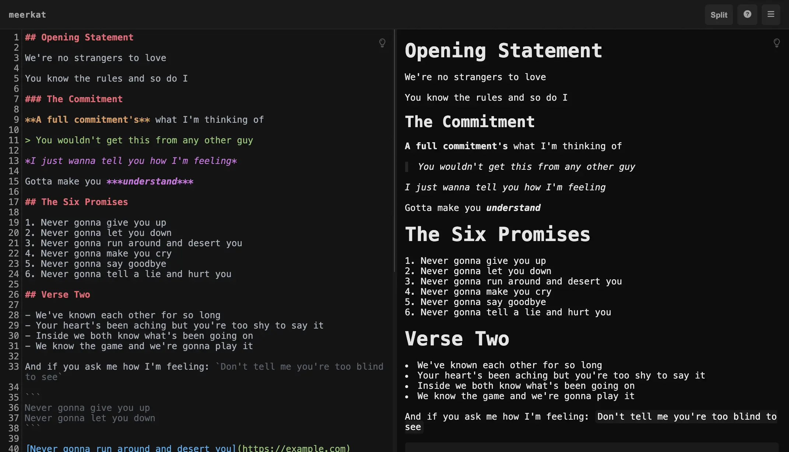

# meerkat

<p align="center"></p>

A minimalist Markdown notepad. Write in Markdown, preview live, share with a link.

## How it works

Type Markdown in the editor. Toggle between split view, editor-only, and preview-only. Every note gets a shareable URL.

- **Split view (default)** — edit on the left, live preview on the right
- **Keyboard shortcuts** — `Ctrl+S` save, `Ctrl+N` new note, `Ctrl+P` cycle views
- **Auto-save** — saves as you type
- **Light mode per panel** — toggle each side independently

## Run

```bash
node server.js
```

Open `http://localhost:3000`.

## Docker

```bash
docker compose up -d
```

The image is published to `ghcr.io/lklynet/meerkat` on push to `main`.

```bash
docker pull ghcr.io/lklynet/meerkat:latest
docker run -d -p 3000:3000 -v ./data:/app/data ghcr.io/lklynet/meerkat:latest
```

## Stack

- Vanilla JavaScript frontend, no framework
- Node.js HTTP server, no framework
- SQLite via node:sqlite
- CodeMirror 5 for editing, marked.js + highlight.js for rendering
- ~3 KB of handwritten CSS
- Minimal Docker image (Alpine)

## License

MIT
